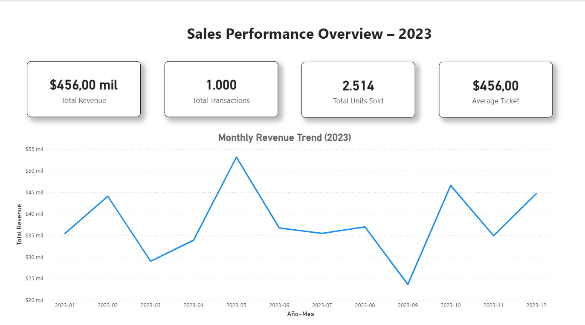
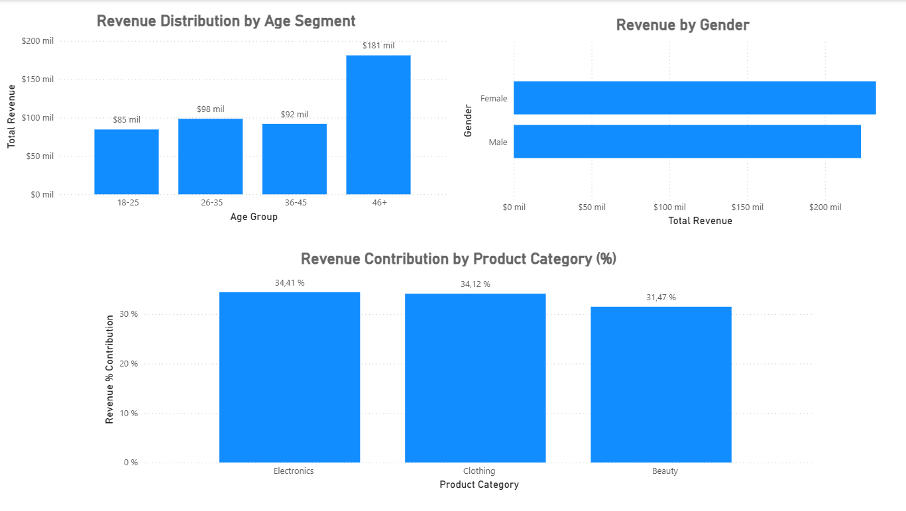
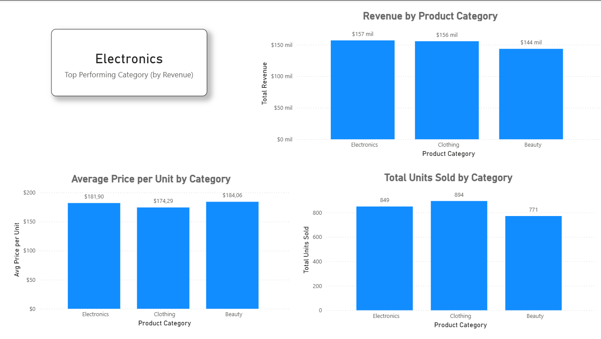

# Retail Sales Performance Dashboard (Power BI)

Interactive Power BI dashboard analyzing retail sales performance, customer segments, and product performance (2023).

## Project Overview

This project presents a 3-page interactive Power BI dashboard built to analyze retail sales data for the year 2023.  

The objective is to provide clear business insights into:

- Revenue performance over time  
- Customer segmentation and behavior  
- Product category performance  
- Key operational KPIs  

The dashboard is designed with a clean executive layout suitable for business stakeholders.

## Business Objectives

- Monitor total revenue and transaction performance  
- Identify the top-performing product category  
- Analyze revenue distribution by age segment and gender  
- Track monthly revenue trends  
- Evaluate pricing and units sold per category  

## Key KPIs

- **Total Revenue**
- **Total Transactions**
- **Total Units Sold**
- **Average Ticket**
- **Top Performing Category (by Revenue)**

## Dashboard Pages

### Sales Performance Overview

**Insights Provided:**

- Executive KPI summary
- Monthly revenue trend (2023)
- Overall performance snapshot

This page gives a high-level executive view of sales performance.

### Customer Insights

**Insights Provided:**

- Revenue distribution by age group
- Revenue by gender
- Revenue contribution by product category (%)

This page helps understand customer segmentation and revenue drivers.

### Product Performance

**Insights Provided:**

- Top Performing Category (dynamic KPI)
- Revenue by product category
- Average price per unit by category
- Units sold per category

This page supports product strategy and pricing decisions.

## Data Modeling & Transformations

- Data cleaned and transformed in **Power Query**
- Conditional column created for **Age Groups**
- Measures built using **DAX**
- KPI card dynamically calculated using `TOPN()` logic
- Consistent formatting and business-friendly layout

## Technical Stack

- Power BI Desktop  
- DAX  
- Power Query (M)  
- CSV Dataset (Retail Sales – 2023)

## Example Business Insights

- Electronics is the top-performing category by revenue.
- Revenue shows seasonality with peak performance mid-year and Q4 recovery.
- Customer segments 26–35 and 36–45 contribute significantly to revenue.
- Product categories contribute relatively evenly to total revenue.

## How to Use

1. Download the `.pbix` file from the `dashboard/` folder.
2. Open with Power BI Desktop.
3. Explore the interactive pages and filters.

## Author

Business Informatics student with a focus on:

- Business Intelligence  
- Data Analytics  
- KPI Monitoring  
- Executive Dashboard Design  

